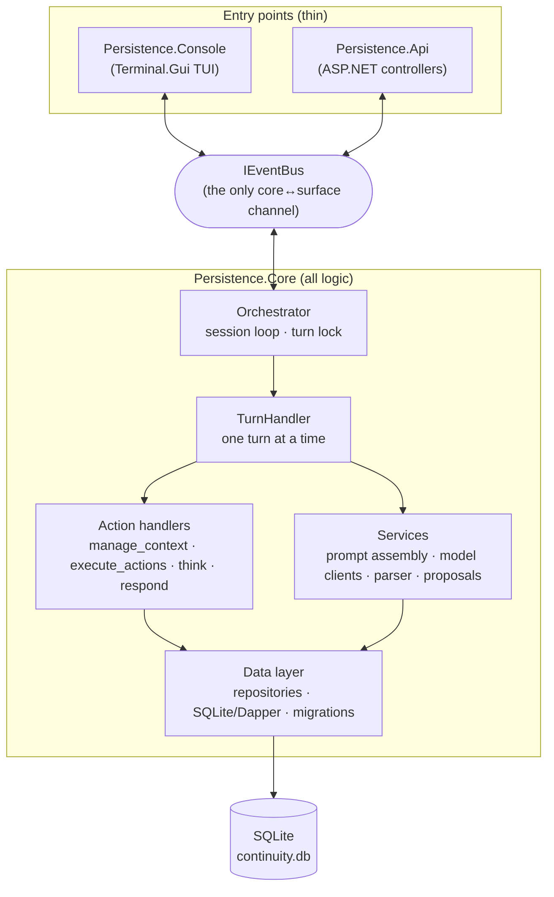

# Architecture

This is the architecture reference for Persistence — written for someone new to the codebase who
wants the mental model before diving into source. It documents the system **as it is built today**
(the older `docs/design.md` was a planning-era sketch and has drifted; it now just points here).

For *why* the big choices were made, see the [ADRs](../adr/). For the design posture (preserve over
erase, inspectable state, provenance, honesty) see [PRINCIPLE.md](../governance/PRINCIPLE.md). For
project-specific patterns in brief, see [CONVENTIONS.md](../CONVENTIONS.md).

## What this system is

Persistence gives a model-side participant — the **remote peer** — durable, self-curated memory that
survives across sessions. Memory is not a transcript cache: it is a store of fragments (identity,
relationships, notes, summaries, chat) that the peer itself inspects and revises through a structured
command protocol, with provenance and an audit trail. The person at the keyboard is the **local
peer**; the two are collaborators, not user-and-tool.

> **Terminology.** *Remote peer* = the model whose continuity we maintain. *Local peer* = the human.
> *Fragment* = the unit of memory. *Working context* = an ordered set of fragments (a "space").
> These terms are used consistently in code, prompts, and fragment metadata.

## The shape of it

Three projects, one brain. All logic lives in `Persistence.Core`; the entry points are thin adapters
that only do I/O and dependency wiring ([ADR-0001](../adr/0001-layered-core-and-thin-entry-points.md)).

The surfaces never call the core directly and the core never calls a surface directly — everything
crosses the boundary as events on the `IEventBus` ([ADR-0002](../adr/0002-event-bus-across-boundaries.md)).
Dependency injection is Autofac with attribute-based registration (`[Singleton]` / `[Service]`),
keyed by `ModelProvider` and `UiMode` where multiple implementations exist.

## The doc set

Read in roughly this order:

1. **[Turn pipeline](turn-pipeline.md)** — the heart of the system: how a turn is triggered (local
   input, a scheduled wake-up, a proposal command), how turns are serialized, and the
   prompt → model → parse → dispatch → persist loop.
2. **[Prompt & model providers](prompt-and-model-providers.md)** — how the prompt is assembled from
   fragments (headers, the sensory block, format instructions), the pluggable model providers, the
   tagged response format, and the context-budget estimate.
3. **[Memory model](memory-model.md)** — the data model: everything-is-a-fragment, working contexts,
   tags, sources, proposals, scheduled events, audit/action logs — and the reversibility posture.
4. **[Data layer](data-layer.md)** — the repository pattern, change tracking + audit-on-save,
   sub-entity hydration, and the migration/seed bootstrap.
5. **[Extensibility](extensibility.md)** — where to add a command, an action, a model provider, or a
   surface. The single-location-extension ethos.
6. **[Remote peer & surfaces](remote-peer-and-surfaces.md)** — the peer model, the "Claude as remote
   peer" broker (drive both sides via the API), and the TUI/API front-ends.

## Quick orientation for the impatient

- A **turn** is one `TurnHandler.ExecuteTurnAsync` call. It loops up to `MaxActionIterations` times,
  calling the model once per iteration and dispatching the actions it returns, until the model stops
  asking to `continue`. All context changes are saved once at the end.
- The model's reply is **tagged text** (`<think>`/`<context>`/`<actions>`/`<respond>`/`<continue>`),
  parsed into an ordered `ModelTurn` of `ModelResponse` actions.
- A **fragment** (`ContextFragmentEntity`) is the unit of memory; a **working context** holds an
  ordered set of them. Almost everything the peer sees is a fragment, including chat messages.
- Adding a peer command = adding one `[Command]`-attributed method on a `CommandHandler`. No registry
  to update.
