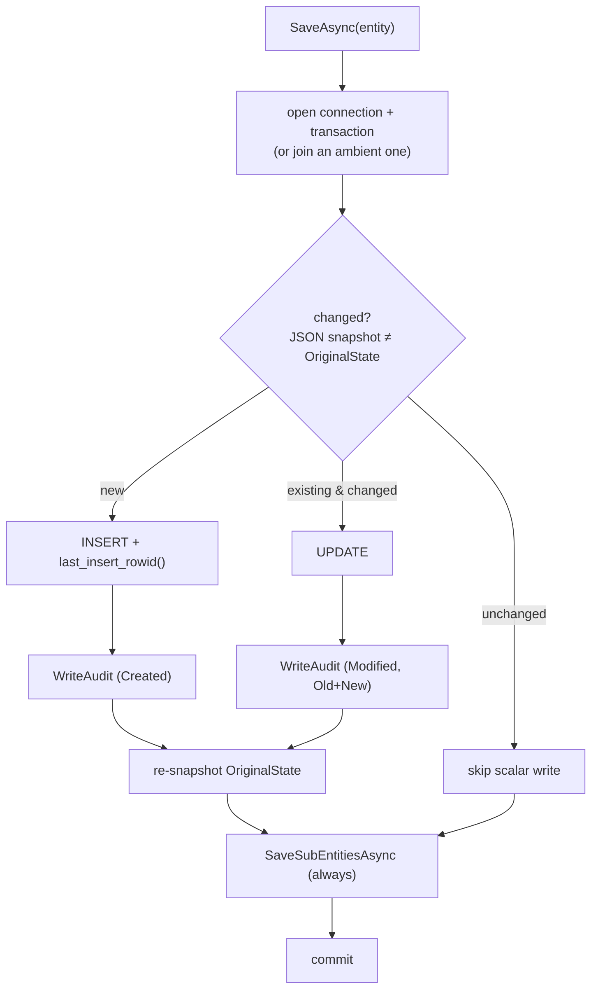

# Data layer

The persistence mechanics under the [memory model](memory-model.md): a generic repository base that
handles change tracking, audit, and transactions; per-entity repositories that add their own SQL and
sub-entity hydration; and a bootstrap that runs migrations and seeds. SQLite via Dapper (with
`InterpolatedSql` for parameterized interpolation).

Key types: [`EntityRepository<T>`](../../src/Persistence.Core/Data/Repositories/EntityRepository.cs),
the concrete repositories in [`Data/Repositories/`](../../src/Persistence.Core/Data/Repositories/),
[`DatabaseManager`](../../src/Persistence.Core/Data/DatabaseManager.cs).

## The repository base (`EntityRepository<T>`)

`EntityRepository<T>` is the only place that opens connections. It provides CRUD, **change tracking**,
**audit-on-save**, and transactions; subclasses supply SQL and child handling via overrides.

**Change tracking.** Every `BaseEntity` carries `IsNew` (true until first save) and `OriginalState` (a
JSON snapshot). On save, the entity is re-serialized and compared to `OriginalState`: unchanged ⇒ the
scalar UPDATE is skipped. `[Computed]`/`[JsonIgnore]` members (collections like `Tags`, `Sources`,
`ContextFragments`) are excluded from the snapshot, so changing only a fragment's tags doesn't dirty
its scalar row — which is why…

**`SaveSubEntitiesAsync` always runs.** Children can change independently of the parent's scalar
fields, so sub-entity sync runs whether or not the parent was "changed." This is where each repository
syncs its junctions:
- `ContextFragmentRepository` → `ContextFragmentSources` (+ auto-attach System source if empty) and
  fragment tags via `EntityTags`.
- `WorkingContextRepository` → saves each fragment, upserts the `WorkingContextFragments` junction
  (relevance/order/collapsed), and syncs the context's own tags.
- `ScheduledEventRepository` → event tags.

**Loading.** `LoadByIdsAsync` is the hydration override — concrete repos issue multi-mapping JOINs to
populate sources/tags/fragments. Hydrated entities are then tracked (`IsNew=false`, snapshot taken) so
they aren't re-inserted on the next save. Reads also stamp `LastAccessedUtc` directly (bypassing
save/audit).

**Audit-on-save.** `WriteAuditAsync` writes an `AuditLogs` row in the *same transaction* as the change
— `Created` (NewData only) or `Modified` (Old + New JSON). It records session, context, source, target
type/id. It self-skips during early bootstrap before the System source exists. This is the canonical
"save entity → write audit → commit, atomically" pattern.

**Transactions.** `SaveAsync` opens its own connection+transaction or **joins an ambient one** passed
in, so multiple repository writes can share a unit of work. `RunInTransactionAsync(work)` opens a
transaction and hands it to a callback (commit on success, rollback on throw) — used, for example, by
`ProposalService` to apply a proposal's change and flip its status atomically.

> **Append-only tables opt out.** `AuditLogEntity` has no `IsNew`/`OriginalState` and overrides
> `TracksLastAccessed => false` — it's immutable history, never updated.

## Concrete repositories

Each entity has an `I…Repository` interface + implementation extending `EntityRepository<T>`, adding
domain queries (e.g. `GetByTagAsync`, `GetDueEventsAsync`, `GetSummariesAsync`, `SearchRelevantAsync`)
and the `GetInsertSql`/`GetUpdateSql`/`LoadByIdsAsync`/`SaveSubEntitiesAsync` overrides. One extra
collaborator is junction-only:

- **`EntityTagRepository`** backs the polymorphic `EntityTags` table. It isn't an
  `EntityRepository<T>` (no entity of its own) — it manages its own connection but accepts an ambient
  transaction so tag writes commit with the owning entity's save. See [Memory model](memory-model.md).

Full-text search uses an FTS5 virtual table (`ContextFragments_fts`) over fragment content/summary,
queried by `SearchRelevantAsync` (BM25 ranking) for the `list_fragments relevant_to=…` path.

## Bootstrap, migrations, seeding (`DatabaseManager`)

`DatabaseManager.InitializeAsync()` runs at startup (from the Orchestrator) and does two things:

1. **Migrate.** Ensure the `Migrations` tracking table exists (`Bootstrap.sql`), read applied
   migration names, then apply each embedded migration not yet recorded — running the script and
   recording its name **in one transaction** per migration. Migrations are numbered and **append-only**:
   never edit an applied migration; add a new one.

2. **Seed sources.** Ensure the canonical `System`, `LocalPeer`, and `RemotePeer` source rows exist and
   cache their ids on the `SessionContext`, so audit entries can be attributed immediately.

(The Orchestrator separately seeds the orientation `System` fragment from
[`fragment_seeds.json`](../../src/Persistence.Core/Data/fragment_seeds.json) and adds a first-wake
guide on a brand-new context.)

### Migration history

| Migration | What it did |
|---|---|
| `Bootstrap.sql` | create the `Migrations` tracking table |
| `000_InitialCreate.sql` | all core tables + junctions + the FTS5 index |
| `001_NarrowSoftDelete.sql` | drop `IsDeleted` from tables that don't soft-delete; keep it only on fragments + working contexts ([ADR-0003](../adr/0003-soft-delete-narrowed-to-peer-memory.md)) |
| `002_AddProposals.sql` | the `Proposals` table |
| `003_UniqueFragmentOrder.sql` | unique index on `WorkingContextFragments(WorkingContextId, Order)` — guards the per-context ordering invariant |
| `004_AddWakePrompt.sql` | add `ScheduledEvents.WakePrompt` |
| `005_GenericTags.sql` | consolidate three per-type tag junctions into the polymorphic `EntityTags`; migrate links; drop the old tables |

## Current tables

Entities: `ContextFragments`, `WorkingContexts`, `Tags`, `Sources`, `ScheduledEvents`, `Proposals`,
`AuditLogs`, `ActionLogs`.
Junctions: `WorkingContextFragments`, `ContextFragmentSources`, `EntityTags`.
System: `Migrations`; plus the `ContextFragments_fts` FTS5 virtual table.
