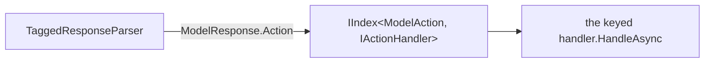

# Extensibility

Persistence favors **single-location, auto-discoverable extension points** over "register it in N
places" patterns. Adding a capability should mean adding *one* attributed thing, not editing an enum +
a switch + a table. This doc is the "where do I add X?" map.

## Add a peer command

By far the most common extension. Commands the peer calls inside `<context>` or `<actions>` are
methods on a [`CommandHandler`](../../src/Persistence.Core/Runtime/CommandHandler.cs) subclass, marked
with `[Command]` + `[CommandField]` and discovered by reflection. The base handles parsing, dispatch,
the built-in `list()`, error formatting, unknown-field "did you mean?" hints, and `ParseId`.

```csharp
[Command("rename_context", "Rename your current working context")]
[CommandField("name", "string", required: true, Description = "The new name")]
private Task<string> ExecuteRenameContextAsync(WorkingContextEntity context, JsonNode? command, CancellationToken ct)
{
    var name = command?["name"]?.GetValue<string>();
    // ... return a peer-facing result string
}
```

That's the whole registration — no list to update, and `list()` plus the prompt describe it
automatically. Two rules:

- **Every field the method reads must be declared as a `[CommandField]`.** The unknown-field hint
  relies on that list being exhaustive (an undeclared field would look like it "worked").
- **Return peer-facing, format-neutral text.** Say plainly whether an action is reversible.

The two command handlers are `ManageContextHandler` (memory: add/update/remove, tag/untag/fetch,
summarize, contexts, proposals, sources…) and `ExecuteActionsHandler` (side-effects: schedule, query
logs). Add a command to whichever fits.

## Add a top-level action (new tag)

Actions are the four `ModelAction`s the parser produces (`Think`, `RespondToUser`, `ManageContext`,
`ExecuteActions`), each handled by an [`IActionHandler`](../../src/Persistence.Core/Runtime/ITurnHandler.cs)
registered **keyed by `ModelAction`**:

```csharp
[Service(registerAsType: typeof(IActionHandler), key: ModelAction.ManageContext)]
public class ManageContextHandler : CommandHandler { … }
```

`TurnHandler` resolves the handler for each action via an `IIndex<ModelAction, IActionHandler>`, so a
new action = a new enum value, a new keyed handler, and a parser mapping for its tag. (Most new
behavior is a *command*, above — not a new action.)



## Add a model provider

Implement [`IModelClient`](../../src/Persistence.Core/Services/IModelClient.cs), register it keyed by a
new `ModelProvider` value, and ensure an `IPromptBuilder` is registered for that key (reuse
`OpenAiPromptBuilder`'s keying or add one). Selection is the `Provider` config value — no switch in
the turn loop. See [Prompt & model providers](prompt-and-model-providers.md).

## Add a front-end surface

Implement [`IDisplayProvider`](../../src/Persistence.Core/Runtime/IDisplayProvider.cs) in a new thin
entry-point project, register it keyed by a new `UiMode`, and communicate only through the
`IEventBus` ([ADR-0001](../adr/0001-layered-core-and-thin-entry-points.md),
[ADR-0002](../adr/0002-event-bus-across-boundaries.md)). The core stays untouched. See
[Remote peer & surfaces](remote-peer-and-surfaces.md).

## Add a taggable entity type

No schema change needed — tags are polymorphic. Hydrate/persist its tags through `EntityTagRepository`
using `nameof(YourEntity)` as the `EntityType`, and (if peer-facing) add it to the `entity_type`
resolver used by `tag`/`untag`/`fetch`. See [Memory model](memory-model.md).

## Add an entity / table

Add a numbered, **append-only** migration (never edit an applied one), an entity extending
`BaseEntity`, and a repository extending `EntityRepository<T>` overriding `GetInsertSql` /
`GetUpdateSql` (and `LoadByIdsAsync` / `SaveSubEntitiesAsync` if it has children). Change tracking and
audit come for free. See [Data layer](data-layer.md).

## The DI mechanism

Registration is Autofac with attribute scanning ([`IoC`](../../src/Persistence.Core/DI/IoC.cs)):
`[Singleton]` / `[Service]` on a type register it across all loaded `Persistence.*` assemblies. A
`key:` makes it resolvable as a keyed strategy (the provider/UI-mode/action pattern); a bare attribute
registers it by its interfaces. The composition root wires `ModelProvider`/`UiMode` from config to the
keyed registrations. This is the engine behind every "keyed by X" extension point above.

## The format layer (if a second wire format is ever wanted)

The response format is owned entirely by `IModelResponseParser` + `IProtocolInstructions`. Handlers
and peer-facing text are format-neutral. Today there's a single format (Tagged), registered plainly;
reintroducing a choice means re-adding keyed selection there — not rearchitecting
([ADR-0004](../adr/0004-pluggable-response-format.md)).
