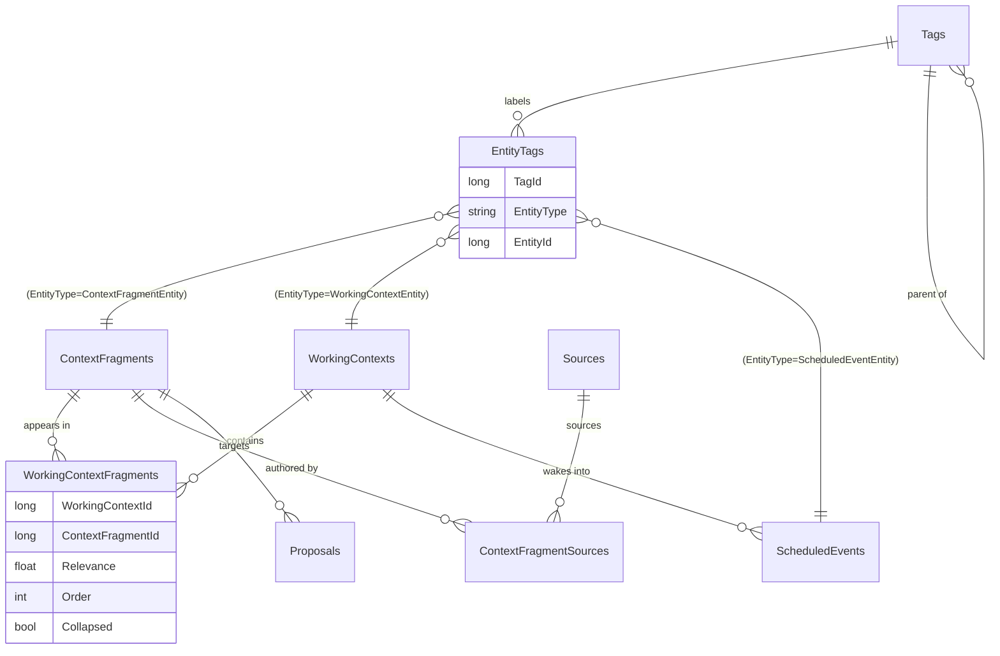

# Memory model

This is the data model the whole system curates. The guiding idea: **everything the peer remembers is
a fragment**, fragments live in **working contexts**, and almost nothing is ever destroyed — it's
archived or detached, recoverable by design ([CONVENTIONS.md](../CONVENTIONS.md),
[PRINCIPLE.md](../governance/PRINCIPLE.md)).

Entities live in [`Data/Entities/`](../../src/Persistence.Core/Data/Entities/); the schema is built by
[migrations](../../src/Persistence.Core/Data/Migrations/) (see [Data layer](data-layer.md)).

## Entity-relationship overview

`AuditLogs` and `ActionLogs` reference contexts/sources too but are write-only history (omitted from
the diagram for clarity; covered below).

## Fragments — the unit of memory

`ContextFragmentEntity` → `ContextFragments`. Chat messages, identity, relationships, notes,
summaries, even command echoes are all fragments, distinguished by `FragmentType`:

| `ContextFragmentType` | Authored by | Persisted? | Purpose |
|---|---|---|---|
| `Identity` | peer | yes | who the peer is — values, chosen name |
| `Relational` | peer | yes | relationships and how the peer relates to others |
| `Personal` | peer | yes | anything else worth keeping (the default) |
| `Summary` | peer | yes | a précis that folds other fragments |
| `ChatMessage` | system | yes | a message exchanged between peers |
| `System` | system | yes | system/orientation fragments |
| `ScratchPad` | system | **no** (transient) | a `<think>` note — informs the turn only |
| `ActionResponse` | system | **no** (transient) | command results / injected notes for the current turn |
| `AuditLog`, `ActionLog` | system | yes | log entries surfaced into context on demand |

Intrinsic fields: `Content`, `Summary`, `Importance`, `Confidence`, `IsProtected`, `IsDeleted`, plus
`Sources` and `Tags`. The peer may author Identity/Relational/Personal/Summary; the rest are
system-managed.

- **`IsProtected`** — a protected fragment cannot be edited or removed directly; the *only* way it
  changes is by accepting a [proposal](#proposals) in a later turn. Identity fragments are the typical
  case.
- **`IsDeleted`** — soft-delete, scoped to peer memory only ([ADR-0003](../adr/0003-soft-delete-narrowed-to-peer-memory.md));
  filtered from reads, recoverable. (Currently the hook for planned forget/undo; not yet set by any
  command.)

## Working contexts — spaces of fragments

`WorkingContextEntity` → `WorkingContexts`. A context is an ordered set of fragments — think "mode" or
"relationship." It holds `Name`, `Summary`, `IsDeleted`, its own `Tags`, and the fragments via the
`WorkingContextFragments` junction.

The junction carries the **context-relative** properties — the same fragment can sit in two contexts
with different relevance/order/collapse:

- `Relevance` (0–1) — ranks inclusion when the budget is tight.
- `Order` — position in the context (unique per context; guarded by a unique index).
- `Collapsed` — render only the summary, to save budget.

In code this is `WeightedContextFragment` (a `ContextFragmentEntity` plus those three junction
fields). The split is deliberate: **fragment-intrinsic properties live on the entity; context-relative
ones live on the junction.**

The peer can browse/create/switch/rename contexts and set their summaries — see the `*_context`
commands in `ManageContextHandler`. A mid-turn `switch_context` is honored at the next iteration
boundary (see [Turn pipeline](turn-pipeline.md)).

## Tags — one polymorphic junction

`TagEntity` → `Tags` is a hierarchy (slash-separated paths like `identity/core`, via `ParentTagId`).
Tags attach to entities through a single polymorphic junction, `EntityTags(TagId, EntityType,
EntityId)`, where `EntityType` is the entity class name. This replaced three per-type junction tables
in [migration 005](../../src/Persistence.Core/Data/Migrations/005_GenericTags.sql) — **adding a new
taggable type now needs no schema change.**

Fragments, working contexts, and scheduled events are all taggable; the peer's `tag` / `untag` /
`fetch` commands take an `entity_type` (default `fragment`). `EntityTagRepository` is the single
surface (`SetTags` / `RemoveTags` / `GetTagsFor` / `GetEntityIdsWithTag`).

## Sources — provenance

`SourceEntity` → `Sources`, with `SourceType` ∈ `System`, `DigitalPeer`, `HumanPeer`,
`DerivedFromFragments` (renamed from `RemotePeer`/`LocalPeer` in ADR-0007; integer values unchanged).
Every fragment has at least one source (the repository auto-attaches the System source if none is given),
linked via `ContextFragmentSources`. `System` and the `DigitalPeer` (the runtime's own voice) are seeded
at startup and cached on the session; each `HumanPeer` is created on demand by name, so several named
people can be attributed distinctly.

## Proposals — deliberated self-change

`ProposalEntity` → `Proposals` (a first-class entity, not a fragment type). A proposal is an
*executable* change the peer records to deliberate on before committing — and it's the only way a
**protected** fragment changes.

- `ProposalKind` ∈ `AddFragment`, `ModifyFragment`, `RemoveFragment`, `ProtectFragment`,
  `UnprotectFragment`.
- `ProposalStatus` ∈ `Open`, `Accepted`, `Rejected`.
- **Deliberation gap:** a proposal can't be accepted in the same turn it was created — enforced by
  comparing `CreatedUtc` against the session's `TurnStartedUtc`.
- **Atomic accept:** `ProposalService.AcceptAsync` applies the carried change and flips the status in
  one transaction — both commit or neither does.
- Who may accept is governed by `ProposalApproval` (`Self` / `Participant` / `Both`). The local peer
  accepts/rejects via `/accept` / `/reject`; a resolution is surfaced back to the remote peer as a
  system note next turn.

## Scheduled events — autonomous wake-ups

`ScheduledEventEntity` → `ScheduledEvents`, with `ScheduledEventStatus` ∈ `Pending`, `Triggered`,
`Cancelled`. The peer schedules a future wake via the `schedule` action, optionally leaving itself a
`WakePrompt` note. `WakeUpMonitor` polls for due events and drives an autonomous turn framed by that
note (see [Turn pipeline](turn-pipeline.md)). Events are taggable.

## Audit & action logs — history

- **`AuditLogs`** (`AuditLogEntity`) — an **append-only** record of entity creates/modifies, written
  in the same transaction as the change (see [Data layer](data-layer.md)). `EventType` ∈ `Created`,
  `Modified` (deletes are a `Modified` flipping `IsDeleted`). It carries `OldData`/`NewData` JSON
  snapshots, the source, session, and context. The sensory block's "recent changes" reads from here.
- **`ActionLogs`** (`ActionLogEntity`) — every dispatched action's type, payload, and result.

Both are queryable by the peer, with results surfaced as transient `AuditLog`/`ActionLog` fragments.

## The reversibility posture

Curation is safe by design, and command descriptions say so plainly so the peer never hesitates:

- `remove` detaches a fragment from the context but **keeps it** — `load`/`fetch` bring it back.
- `summarize_fragments` folds fragments into a summary and **archives** the originals.
- `toggle_summary_display` only collapses the view.
- The single genuinely permanent action is `delete_tag` — and even that only removes a label; the
  fragments it was on are untouched.

`Status = Archived` ≠ deletion; soft-delete is recoverable; provenance lives in the audit log.
