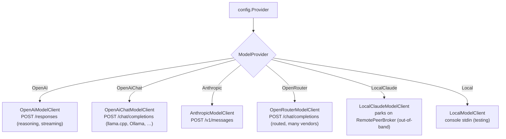

# Prompt assembly & model providers

This covers everything between "here is the working context" and "here is a parsed `ModelTurn`": how
the prompt is built, how it's adapted per provider, how the model is called, the wire format the peer
replies in, and how the context-budget estimate is computed.

Key types: [`PromptFormatter`](../../src/Persistence.Core/Services/PromptFormatter.cs),
[`IPromptBuilder`](../../src/Persistence.Core/Services/IPromptBuilder.cs) implementations,
[`IModelClient`](../../src/Persistence.Core/Services/IModelClient.cs) implementations,
[`TaggedResponseParser`](../../src/Persistence.Core/Services/TaggedResponseParser.cs),
[`TaggedProtocolInstructions`](../../src/Persistence.Core/Services/TaggedProtocolInstructions.cs).

## The pipeline

```mermaid
flowchart LR
    WC["WorkingContext<br/>(ordered fragments)"] --> PF["PromptFormatter.Format()"]
    PF --> SEG["List&lt;PromptSegment&gt;<br/>fragments + instructions + sensory"]
    SEG --> PB["IPromptBuilder.Build()<br/>(keyed by provider)"]
    PB --> REQ["PromptRequest<br/>(role-tagged messages)"]
    REQ --> MC["IModelClient<br/>(keyed by provider)"]
    MC --> RAW["raw text"]
    RAW --> RP["TaggedResponseParser.Parse()"]
    RP --> MT["ModelTurn<br/>(ordered ModelResponse + Continue)"]
```



## Prompt assembly (`PromptFormatter`)

`Format(context, tags, iteration, maxIterations, recentChanges)` turns the working context into an
ordered `List<PromptSegment>` (each segment has a `Source` name and `Content`). The order matters:

1. **One segment per fragment**, in working-context order, each with a metadata header:

   ```
   [#42 | Identity | r:0.9 i:0.8 c:1.0 | protected | collapsed]
   <fragment content, or just its summary when collapsed>
   ```

   - `#ID` — the fragment's id (used to address it in commands).
   - `Type` — `ContextFragmentType` (see [Memory model](memory-model.md)).
   - `r/i/c` — relevance (context-relative), importance, confidence.
   - `protected` — present when the fragment can only change via a proposal.
   - `collapsed` — present when only the summary is shown (to save budget).

2. **The format instructions** (`IProtocolInstructions.GetInstructions()`).
3. **The sensory block** — the peer's real-time situational awareness.

> **Why instructions + sensory go at the *end*.** Format adherence degrades with distance from the
> point of generation, so the authoritative "how to respond" lives closest to where the model writes.
> Identity/persona lives in fragments *above*. (See [CONVENTIONS.md](../CONVENTIONS.md).)

### The sensory block

The `[Sensory]` section gives the peer eyes on its own state ([ADR-0005](../adr/0005-context-budget-eyes-and-hands.md)):

- Current time (UTC + local with timezone) and the session id.
- **Context budget** — a calibrated token estimate vs. a model-aware effective budget, with escalating
  nudges as it fills (so the peer curates before it's truncated, never *because* it was).
- Time since the last prompt; the **continue iteration** counter (e.g. `2/5`) when looping.
- **Recent changes to your memory** — the last N audit entries, so the peer re-orients across sessions.
- **Available tags** — the tag tree (or "No tags exist yet").

## Per-provider adaptation (`IPromptBuilder`)

Segments are provider-neutral; a keyed `IPromptBuilder` maps them to a `PromptRequest` (a list of
role-tagged `PromptMessage`s):

- **`OpenAiPromptBuilder`** (used for `OpenAI`, `OpenAiChat`, `LocalClaude`, `Anthropic`,
  `OpenRouter`) maps each segment's `Source` to a role — System→`developer`, Remote
  Peer→`assistant`, everything else→`user` — and collapses adjacent same-role messages.
- **`LocalPromptBuilder`** (used for `Local`) collapses to a single system message + a single user
  message — the simplest shape, for the console testing client.

> **Every provider needs a builder.** The index is keyed by `ModelProvider`, so a provider registered
> as an `IModelClient` but missing here fails at *startup* with an opaque Autofac "service has not been
> registered" — for a containerised peer, a boot loop. `ProviderRegistrationCompletenessTests` asserts
> both registrations exist for every enum value, so the gap shows up as a named test failure instead.

## Model providers (`IModelClient`)

The provider is chosen by the `ModelProvider` config value; each client is registered keyed by that
enum, so selection is config, not code.



| Provider | Client | Notes |
|---|---|---|
| `OpenAI` | `OpenAiModelClient` | OpenAI Responses API (`/responses`); reasoning effort; live streaming of output + reasoning summary; records real token usage for budget calibration |
| `OpenAiChat` | `OpenAiChatModelClient` | OpenAI-compatible Chat Completions (`/chat/completions`) for local servers; flattens to a template-safe system + single user message |
| `Anthropic` | `AnthropicModelClient` | Claude Messages API (`/v1/messages`); cache-aware token usage |
| `OpenRouter` | `OpenRouterModelClient` | [OpenRouter](https://openrouter.ai) — one key in front of many vendors; `Model` is a namespaced route (`z-ai/glm-5.2`). Always requires a key. Reports each call's **actual** USD cost, not just tokens |
| `LocalClaude` | `LocalClaudeModelClient` | no HTTP model — parks the prompt on the [broker](remote-peer-and-surfaces.md) for an external agent to answer out-of-band |
| `Local` | `LocalModelClient` | prints the prompt and reads a reply from the console; for infrastructure testing without a model |

`OpenAiChat` and `OpenRouter` share their wire shape through `ChatCompletionsProtocol` (message
flattening, content extraction, the cached/uncached usage split) — what differs is the endpoint, auth,
and OpenRouter's usage-accounting request. A fix to the shape lands for both at once.

All implement `CompleteAsync` (→ raw string) and `StreamAsync` (→ `IAsyncEnumerable<ModelStreamEvent>`
of `OutputTextDelta` / `ReasoningSummaryDelta` / `Completed`). The non-streaming and streaming turn
paths are otherwise identical; streaming additionally publishes `ModelReasoningDelta` events for live
display.

## The context-budget estimate

`TokenEstimator` uses a deliberately coarse ~4-chars-per-token heuristic (provider-agnostic, no lag).
`TokenUsageTracker` records the *real* input-token count returned by the last provider call alongside
the estimate, so the sensory block's budget line can be calibrated against the provider's actual
tokenizer rather than drifting. Turns are serialized, so a single "last" value suffices.

## The response format (Tagged)

The peer replies in the **tagged format** — prose tags plus function-call command blocks — chosen
because prose (replies, thoughts, fragment content) never needs escaping, which weaker/local models
handled badly in JSON ([ADR-0004](../adr/0004-pluggable-response-format.md), resolved in favour of
Tagged; JSON was removed).

```
<think>free-form reasoning (transient)</think>
<context>
add(content="""a note""", importance=0.8, tags=["theme/x"])
tag(entity_type="context", tag="mode/reflection")
</context>
<actions>
schedule(name="check-in", scheduled_for=2026-06-10T13:00Z)
</actions>
<respond>Message to the local peer. "Quotes" and newlines are fine.</respond>
<continue>false</continue>
```

`TaggedResponseParser.Parse()`:

- Matches each top-level `<tag>…</tag>` in document order.
- `<think>`/`<respond>` become text actions (`Think` / `RespondToUser`), body carried as a JSON string.
- `<context>`/`<actions>` bodies are handed to `FunctionCallParser`, which turns the
  `command(field=value)` lines into the same JSON command array the command handlers consume — so the
  handler layer is format-agnostic.
- `<continue>` sets the `Continue` flag (absent ⇒ false).
- Unknown tags are ignored (models can wrap output in extra markup harmlessly).
- Output with no recognised tag returns a *failed* `ModelTurn`, which the turn loop feeds back for a
  retry.

The result is a `ModelTurn { Actions: ModelResponse[], Continue, ParsedSuccessfully }`, each
`ModelResponse` carrying a `ModelAction` and a `JsonNode? Data`. Dispatch is covered in
[Turn pipeline](turn-pipeline.md).

> **Format layering.** The parser and the protocol instructions are the *only* places that know the
> wire format. Handlers and peer-facing error/guidance text stay format-neutral, so a second format
> could be reintroduced behind keyed selection without touching the rest.
