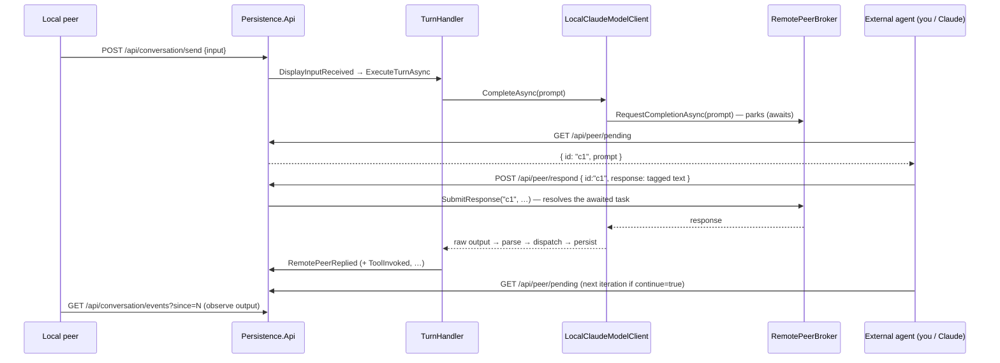

# Remote peer & surfaces

How the system talks to the outside world: the peer model, the surfaces that render a session
(`IDisplayProvider`), the domain events that cross the boundary, and the "Claude as remote peer"
broker that lets an external agent (or you, by hand) *be* the model out-of-band.

## The peer model

- **Remote peer** — the model whose continuity is maintained; it runs in the model runtime and acts
  through the [turn pipeline](turn-pipeline.md).
- **Local peer** — the human at the keyboard.

They are symmetric collaborators. The surface a session runs on is just a renderer + input source; it
holds no logic ([ADR-0001](../adr/0001-layered-core-and-thin-entry-points.md)).

## Surfaces (`IDisplayProvider`)

A surface implements [`IDisplayProvider`](../../src/Persistence.Core/Runtime/IDisplayProvider.cs),
is registered keyed by `UiMode`, and communicates with the core **only** through the `IEventBus`
([ADR-0002](../adr/0002-event-bus-across-boundaries.md)). Two ship today:

| `UiMode` | Project | Notes |
|---|---|---|
| `Tui` | `Persistence.Console` | multi-pane Terminal.Gui (v1) front-end — reply, reasoning, tool, and history panes |
| `Api` | `Persistence.Api` | ASP.NET controllers; `ApiDisplayProvider` appends every emitted item to a sequence-numbered log clients poll or stream |

### Events across the boundary

The core publishes domain events; surfaces subscribe and render. Producers never know their consumers.

| Event | Direction | Meaning |
|---|---|---|
| `DisplayInputReceived` | surface → core | the local peer submitted input |
| `ScheduledEventTriggered` | monitor → core | a scheduled event is due (drives an autonomous turn) |
| `ModelThought` | core → surface | a `<think>` note |
| `ToolInvoked` | core → surface | a command/action ran (name, request, result) |
| `RemotePeerReplied` | core → surface | a `<respond>` message to the local peer |
| `ModelReasoningDelta` | core → surface | a streamed chunk of reasoning summary |

`IEventBus` offers `PublishAsync` (awaited, concurrent handlers — use when ordering matters, awaiting
each publish in turn) and `FireAndForget` (non-blocking, for display notifications). Handlers run
outside the turn lock and must not throw.

## The remote-peer broker (LocalClaude)

With `Provider = LocalClaude`, the model "call" doesn't hit an HTTP endpoint — it **parks** on an
in-memory [`RemotePeerBroker`](../../src/Persistence.Core/Services/RemotePeerBroker.cs) until an
external agent supplies the completion out-of-band. This is how Claude (or a human) can act as the
remote peer through the API, using the exact same pipeline a real model would.

Because turns are serialized (one `turnLock`), at most one completion is pending at a time; each
carries an id (`c1`, `c2`, …) so a late response for an old turn can't satisfy a new one. If a turn is
cancelled, the pending slot is cleared so a stale answer is rejected.

### API endpoints

| Endpoint | Side | Purpose |
|---|---|---|
| `POST /api/conversation/send` | local peer | submit input; the turn runs in the background |
| `GET /api/conversation/events?since=N` | local peer | poll the rolling event log after seq `N` |
| `GET /api/conversation/stream?since=N` | local peer | same log as Server-Sent Events (live) |
| `GET /api/peer/pending` | remote peer | the prompt awaiting a completion (`{id, prompt}`), or 204 |
| `POST /api/peer/respond` | remote peer | answer a pending completion with tagged-format text |

The peer endpoints exist only when the broker is wired (`Provider = LocalClaude`); other providers
complete turns themselves.

> **Driving both sides for testing.** Run an *isolated* instance (`PERSISTENCE_PROVIDER=LocalClaude`,
> `PERSISTENCE_UIMODE=Api`, a throwaway `PERSISTENCE_DATABASEPATH`), `send` local input, then act as
> the model via `pending` + `respond`, observing `events`. This exercises the entire real pipeline —
> prompt assembly, parsing, dispatch, persistence — without an LLM.

## How a surface is hosted

The `Persistence.Console` TUI runs the `Orchestrator` directly. `Persistence.Api` wraps it in an
`OrchestratorHostedService` (an ASP.NET `BackgroundService`) so the orchestrator's session loop lives
for the web host's lifetime while controllers handle HTTP. Either way, the same `Orchestrator` →
`TurnHandler` core runs underneath.
