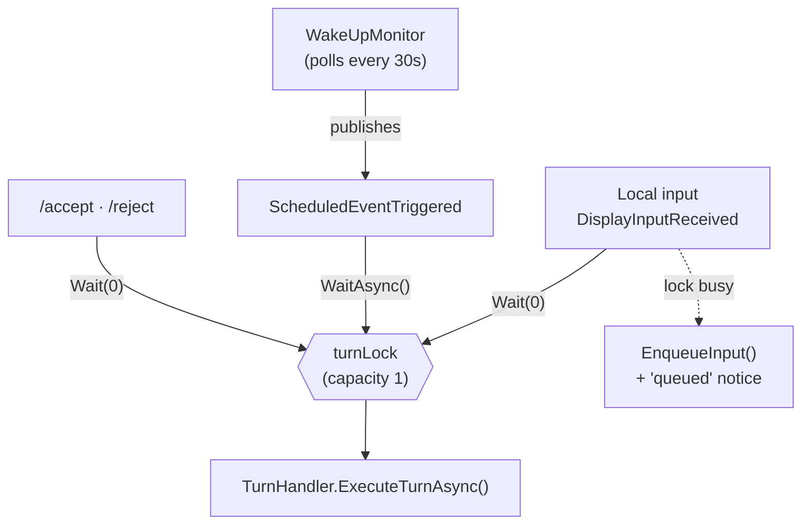

# Turn pipeline

A **turn** is one cycle of "the remote peer is given its context and acts on it." This is the spine
of the system. Everything else (prompt assembly, model providers, the memory model) exists to serve
the turn.

Key types: [`Orchestrator`](../../src/Persistence.Core/Runtime/Orchestrator.cs),
[`TurnHandler`](../../src/Persistence.Core/Runtime/TurnHandler.cs),
[`WakeUpMonitor`](../../src/Persistence.Core/Runtime/WakeUpMonitor.cs),
the action handlers in [`Runtime/ActionHandlers/`](../../src/Persistence.Core/Runtime/ActionHandlers/).

## What triggers a turn

Three things can start a turn, and they all funnel through one lock so only one turn runs at a time:

| Trigger | Source | How it acquires the turn lock |
|---|---|---|
| **Local input** | `DisplayInputReceived` event from a surface | non-blocking `Wait(0)` — if a turn is already running, the input is **queued** (`EnqueueInput`) and the local peer is told so |
| **Scheduled wake-up** | `ScheduledEventTriggered` from `WakeUpMonitor` | blocking `WaitAsync()` — waits its turn, then runs an autonomous turn framed by a wake note |
| **Proposal resolution** | `/accept` / `/reject` slash command | non-blocking `Wait(0)`; on success queues a system note (`EnqueueSystemNote`) surfaced to the peer next turn |

The `Orchestrator` owns a `SemaphoreSlim turnLock = new(1, 1)`. Turns are serialized — there is never
more than one in flight (see [Concurrency](#concurrency) below). The model is called one prompt at a
time, which is why a single in-memory `RemotePeerBroker` slot is sufficient for the LocalClaude
provider (see [Remote peer & surfaces](remote-peer-and-surfaces.md)).



## Inside a turn

`TurnHandler.ExecuteTurnAsync(input?, wakeNote?, ct)` runs the loop. The same method serves a normal
turn, an autonomous wake-up (`wakeNote` set, no `input`), and a continued turn.

```mermaid
sequenceDiagram
    participant O as Orchestrator
    participant T as TurnHandler
    participant F as PromptFormatter
    participant M as IModelClient
    participant P as TaggedResponseParser
    participant H as IActionHandler(s)
    participant R as WorkingContextRepository
    participant B as IEventBus

    O->>T: ExecuteTurnAsync(input / wakeNote)
    T->>T: stamp TurnStartedUtc
    T->>T: drain system notes; persist user msg; drain queued input
    loop until !Continue or MaxActionIterations
        T->>F: Format(context, tags, iteration, recentChanges)
        F-->>T: prompt segments
        T->>M: Complete / Stream(request)
        M-->>T: raw output
        T->>P: Parse(raw) → ModelTurn (ordered actions + Continue)
        alt parse failed
            T->>T: feed error back, retry (counts an iteration)
        else parsed
            loop each action in order
                T->>H: HandleAsync(context, data)
                H->>B: publish ToolInvoked / ModelThought / RemotePeerReplied
            end
        end
        opt switch_context happened this round
            T->>R: save current, load target context
        end
    end
    T->>R: SaveAsync(context) — single end-of-turn save
```

Step by step:

1. **Stamp `TurnStartedUtc`** on the session. This is what enforces the proposal *deliberation gap* —
   a proposal can't be accepted in the same turn it was created (see [Memory model](memory-model.md)).
2. **Pre-loop housekeeping.** Drain any queued system notes (e.g. "your peer accepted proposal #5")
   and the wake note into the context as transient fragments; persist the local peer's message as a
   `ChatMessage` fragment; drain any input that was queued while a prior turn was running.
3. **The iteration loop** (`iteration <= MaxActionIterations`):
   - **Format** the working context into prompt segments via `PromptFormatter` — fragments with
     metadata headers, then the format instructions and the sensory block at the *end*
     (see [Prompt & model providers](prompt-and-model-providers.md)).
   - **Call the model** — streaming or non-streaming per config — yielding raw text.
   - **Parse** the raw text into a `ModelTurn`: an ordered list of `ModelResponse` actions plus a
     `Continue` flag. A parse failure is fed back to the model as a transient fragment and retried
     (the failed attempt still counts toward the iteration cap, so a model that never produces valid
     output can't loop forever).
   - **Dispatch** each action in document order to its `IActionHandler` (keyed by `ModelAction`). A
     handler that throws yields an error fragment — it does not crash the turn. Each dispatch is
     logged to the action log.
   - If the model set `<continue>true`, loop again with the updated context; otherwise stop. If a
     `switch_context` repointed the session mid-turn, the current context is saved and the target
     loaded so the next iteration operates on the new one.
4. **One end-of-turn save.** All context mutations from the turn are persisted in a single
   `WorkingContextRepository.SaveAsync` (transient fragment types like `ScratchPad`/`ActionResponse`
   are skipped automatically).

## Actions

The parser maps tags to `ModelAction`s; each has a handler:

| Tag | `ModelAction` | Handler | Effect |
|---|---|---|---|
| `<think>` | `Think` | `ThinkHandler` | a transient reasoning note in context (not saved, not sent to the peer) |
| `<respond>` | `RespondToUser` | `RespondToUserHandler` | a message to the local peer (published as `RemotePeerReplied`) |
| `<context>` | `ManageContext` | `ManageContextHandler` | memory commands: add/update/remove, tag/untag/fetch, summarize, contexts, proposals… |
| `<actions>` | `ExecuteActions` | `ExecuteActionsHandler` | side-effects: schedule wake-ups, query audit/action logs |

`<context>` and `<actions>` bodies are newline-separated `command(field=value)` calls; the command
layer is described in [Extensibility](extensibility.md). A turn may combine several actions (e.g.
think → manage context → respond) and they run top-to-bottom.

## Concurrency

- **One turn at a time.** The `turnLock` semaphore guarantees serialized turns regardless of trigger.
- **Local input is never blocked.** If the peer is mid-turn, new local input is queued and either
  drained into the *current* turn (so the local peer can type while the peer is "thinking") or starts
  the next turn. Queued input arriving mid-turn is surfaced as a transient note so the peer knows it
  came in late.
- **Wake-ups and proposal commands wait** for the lock rather than being dropped: wake-ups block
  (`WaitAsync`), proposal commands try-lock and report "busy" if they can't get in immediately.
- **The poll loop is decoupled from the lock.** `WakeUpMonitor` polls `GetDueEventsAsync` every 30s
  and only *publishes* events; the Orchestrator acquires the lock to run the resulting turn, so a slow
  turn never stalls the poller.
- **Events run outside the lock** and must not throw (an event-bus discipline from
  [ADR-0002](../adr/0002-event-bus-across-boundaries.md)).

## Events emitted during a turn

Handlers and the turn loop publish domain events that surfaces render (see
[Remote peer & surfaces](remote-peer-and-surfaces.md) for the full table): `ModelThought`,
`ToolInvoked`, `RemotePeerReplied`, and `ModelReasoningDelta` (streamed). The core publishes; it never
formats for a specific surface.
